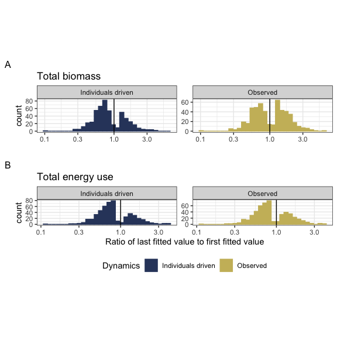
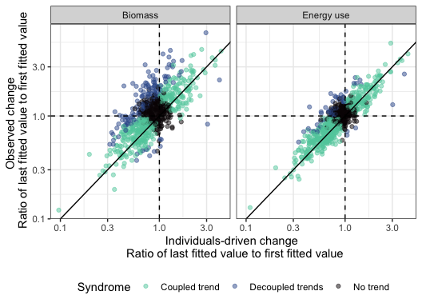
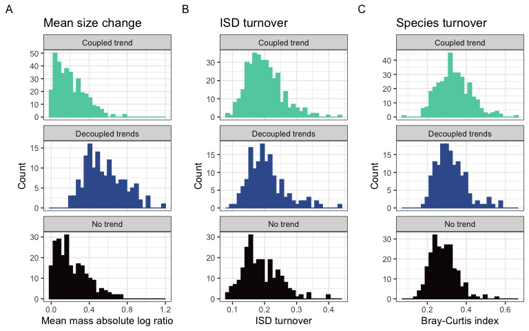

# Figure 1.

<!-- individuals-driven vs. observed change -->

<!-- -->

#### Figure 1.

<!-- Illustration of individuals-driven (null model) dynamics as compared to observed dynamics (A), and the underlying dynamics of the ISD (B) for a sample route (LINDBROOK, Alberta). **A. Dynamics of total biomass.** The gold points show the true values for total biomass in each year, and the blue points show the values for total biomass simulated from a null model that incorporates change in total abundance, but assumes no change in the size structure, over time. The smooth lines show the predicted values from a Gamma (log-link) linear model of the form `total_biomass ~ year * Dynamics`.  For this route, change in the individual size distribution has decoupled the dynamics of biomass from those that would occur due only to changes in abundance. The slope for individuals-driven dynamics is significantly more negative than for the observed dynamics (interaction term p = 0.0013). **B. Underlying changes in the ISD.** The individual size distributions for the first 5 years (solid lines) and last 5 years (dashed lines) of the timeseries. The x-axis is body size (as mass in grams; note log scale) and the y-axis is probability density from a Gaussian mixture model fit to a vector of simulated individual masses for all individuals observed in the years in questions, standardized to sum to 1. For the individuals-driven (blue) scenario, individuals' species identities (which determine their body size estimates) are re-assigned at random weighte by each species' mean relative abundance throughout the timeseries, resulting in a consistent individual size distribution over time. For the observed (gold) scenario, individuals' body sizes are estimated based actual species abundances at each time step. For this route, species composition has shifted over time and produced different ISDs for the "begin" and "end" time periods. Specifically, the "end" ISD has peaks at larger body sizes (ca. 90g and 500g) not present in the "begin" ISD. This redistribution of density towards larger body sizes results in an overall increase in body size community wide, which partially offsets declines in total biomass from those expected given change in abundance alone.  -->
# Figure 2.

<!-- Directions and magnitudes of change. -->

<!-- -->

#### Figure 2

<!-- . Long-term trends in total biomass and energy use -->
<!-- Histograms showing the direction and magnitude of change over time for the individuals-driven (left) and observed (right) changes in biomass (A) and energy use (B), for communities with a significant slope and/or interaction term (for biomass, 500/739 routes; for energy use, 509/739 routes). Change is summarized as the ratio of the fitted value for the last year in the time series to the fitted value for the first year in the timeseries from the best-fitting model for that community. Values greater than 1 (vertical black line) indicate increases in total energy or biomass over time, and less than 1 indicate decreases. The individuals-driven dynamics (left) reflect the trends fit for the null model, while the observed dynamics (right) reflect trends incorporating both change in total abundance and change in the size structure over time. For communities with no significant interaction term in the best-fitting model, the "individuals-driven" and "observed" ratios will be the same; interaction terms will result in different ratios for "individuals-driven" and "observed" dynamics.  -->
<!-- Among routes with temporal trends, there are qualitatively different continental-wide patterns in individuals-driven and observed dynamics for total biomass and total energy use. 70% of trends in individuals-driven dynamics for energy use are decreasing, and 67% for biomass. However, for biomass, observed dynamics are balanced evenly between increases (49% of routes) and decreases (51%) - indicating that changes in the size structure produce qualitatively different long-term trends for biomass than would be expected given abundance changes alone. However, trends for energy use (which scales nonlinearly with biomass) are dominated by decreases (35% of routes), more closely mirroring the trends expected given changes in abundance.  -->
# Figure 3. Visualizing decoupling

<!-- -->

#### Figure 3

<!-- . Decoupling between individuals-driven and observed trends. -->
<!-- Observed change (ratio of last fitted value to first fitted value, y-axis) in total biomass (left) and total energy use (right) compared to the change expected only due to changes in total abundance (ratio of last fitted value to first fitted value, x-axis). Values greater than 1 (dashed horizontal and vertical lines) mark positive (increasing) trends, while values less than 1 are negative trends. Each point marks the fitted values from a Gamma log-link generalized linear model of the form `response ~ year * dynamics` for a given route. This estimates separate long-term slopes for observed and individuals-driven dynamics. Points are colored corresponding to the best-fitting model (intercept-only, or "no trend"; a slope for year but no difference in slopes between observed and individuals-driven dynamics, or "coupled trend", and separate slopes for observed and individuals-driven dynamics, "decoupled trends") for each route. Deviations from the 1:1 line (solid black line) reflect changes in the community size structure that modulate the relationship between total abundance and total biomass or energy use.  -->
<!-- Changes in total biomass and total energy use generally track changes driven by fluctuations in total abundance, with appreciable scatter around the 1:1 line. When this translates into a statistically detectable decoupling between observed and individuals-driven dynamics ("Decoupled trends"), this is usually in the form of individuals-driven change being more negative (a steeper decline or a smaller increase) than observed change in biomass or energy use (a less steep decline or larger increase), resulting in points falling above and to the left of the 1:1 line. This occurs more strongly and frequently for biomass than for energy use. -->

# Figure 4

<!-- -->

#### Figure 4

<!-- . Histograms of change in community structure for routes showing no trends, coupled, and decoupled trends in individuals-driven and observed dynamics. -->
<!-- Histograms of (A) change in mean body size from the first to the last five years of monitoring, (B) overall change in the size structure, and (C) change in species composition for routes whose dynamics for  total biomass were best-described using no temporal trend (bottom row; intercept-only model), separate trends for observed and individuals-driven dynamics (middle row), or the same trend for observed and individuals-driven dynamics (top row). Change in mean body size (A) is calculated as the ratio of the mean body size of all individuals observed in the last 5 years of the timeseries relative to the mean body size of all individuals observed in the first 5 years. Overall change in the ISD (B) is calculated as the degree of turnover between the ISDs for the first and last five years of the timeseries (see text). Change in species composition (C) is Bray-Curtis dissimilarity comparing species composition in the first five years to the last five years.  -->
<!-- Routes that exhibit decoupling between observed and individuals-driven changes in total biomass exhibit a high prevalence of increases and decreases in mean body size (middle row, panel A) compared to the changes seen in routes that show either no trend or non-decoupled trends. However, routes with all three signatures of dynamics (coupling, decoupling, or no trend) are not detectably different in the degree of overall change in the ISD or in species composition over time (panels B and C). -->
# Tables

<!-- and directions of trends  -->

### Table 1.

| Currency         | Selected model       | Number of routes | Proportion of routes |
|:-----------------|:---------------------|-----------------:|---------------------:|
| Total biomass    | Intercept-only       |              238 |                 0.32 |
| Total biomass    | Trend, not decoupled |              352 |                 0.48 |
| Total biomass    | Decoupled trend      |              149 |                 0.20 |
| Total energy use | Intercept-only       |              230 |                 0.31 |
| Total energy use | Trend, not decoupled |              456 |                 0.62 |
| Total energy use | Decoupled trend      |               53 |                 0.07 |

#### Table 1

Table of the number and proportion of routes whose dynamics for total
biomass and total energy use are best described by the following
syndromes: no directional change (intercept-only model, biomass \~ 1 or
energy use \~ 1); a coupled trend (biomass \~ year or energy use \~
year); or a model with decoupled temporal trends for observed and
individuals-driven dynamics (biomass \~ year \* dynamics or energy use
\~ year \* dynamics, where dynamics refers to observed or null model,
individuals-driven dynamics).

31-32% of routes are best described as syndromes of “No directional
change” (intercept-only models). For the remaining routes, in most
instances, the dynamics of biomass and energy use exhibit a temporal
trend, but with no detectable difference in the temporal trends for
individuals-driven and observed dynamics (“Coupled trends”). However,
for a substantial minority of routes (20% overall for biomass, or 30% of
routes with a temporal trend; 7% overall for energy use, or 10% of
routes with a temporal trend), there is a detectable deviation between
the trends expected due only to changes in abundance and the observed
dynamics (“Decoupled trends”).

### Table 2.

| Currency         | Proportion of increasing individuals-driven trends | Proportion of increasing observed trends | Number of routes with temporal trends |
|:-----------------|---------------------------------------------------:|-----------------------------------------:|--------------------------------------:|
| Total biomass    |                                               0.33 |                                     0.49 |                                   501 |
| Total energy use |                                               0.30 |                                     0.35 |                                   509 |

#### Table 2

The proportion of trends that are increasing (specifically, for which
the ratio of the last fitted value to the first fitted value \> 1) for
individuals-driven and observed dynamics, for routes exhibiting temporal
trends (“coupled trends” or “decoupled trends”) in total biomass and
total energy use (for biomass, n = 500; for energy use, n = 509). Trends
that are not increasing are decreasing.

Trends in individuals-driven dynamics are dominated by declines (67% of
routes for total biomass, and 70% of routes for total energy). Observed
dynamics for biomass differ qualitatively from the individuals-driven
dynamics. Specifically, observed trends in biomass are evenly divided
between increases and decreases (49% increasing). Observed trends in
energy use more closely mirror individuals-driven trends (65% declines).

<!-- \newpage -->
<!-- # References -->
